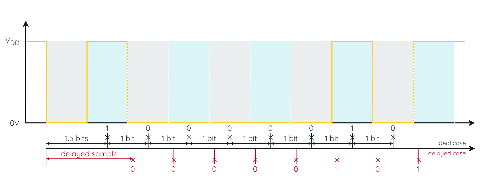
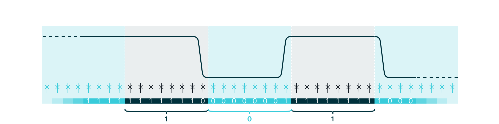
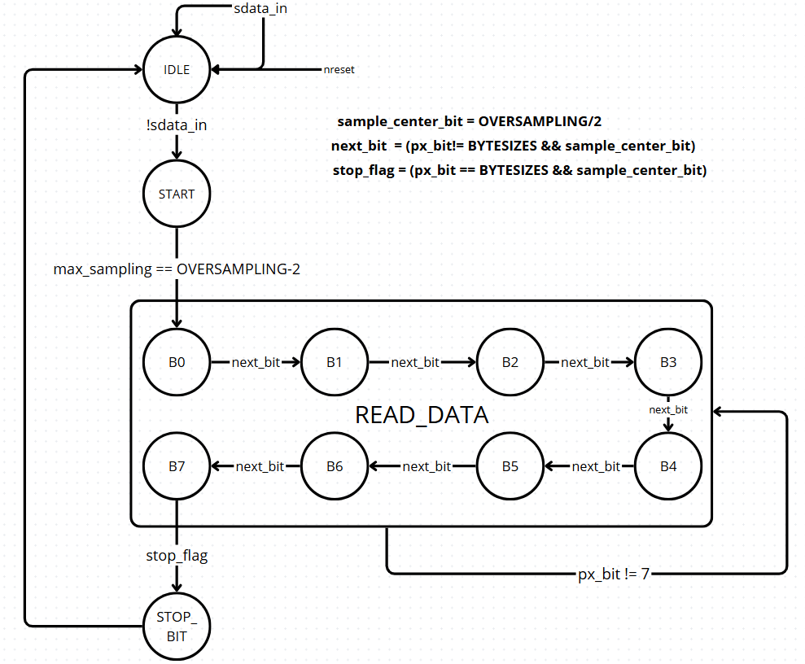
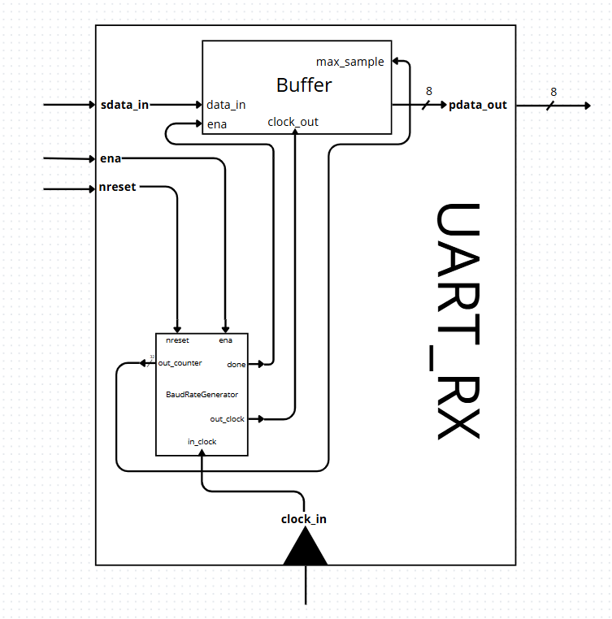

# UART

Descrição de Hardware de uma UART (Universal Asynchronous Receiver/Transmitter) para conexão com o barramento wishbone e com DMA.

# Projeto de uma UART com sobreamostragem

## Atraso de amostragem

# Receptor UART-Rx

## Parâmetros Personalizados

    ` BYTESIZES := Tamanho do byte a ser recebido                     ; Valor padrão 1byte ou 8bites`

    ` BAUNDRATE := Velocidade de comunicação                          ; Valor Padrão 115200 Símbolos/Segundos`

    ` OVERSAMPLING := Quantas vezes um bit serial será sobreamostrado ; Valor Padrão 16xBaundRate`

    ` COUNTER_CLOCK_INPUT := Frequência do clock de entrada           ; Valor Padrão 50Mhz`

## Entradas 
    ` clock   := Sinal de clock                                                   ; 1bit `

    ` nreset  := Sinal de reset na borda descendente ou normalmente baixo ativo   ; 1bit `

    ` sdata   := Dado serial a ser recebido                                       ; 1bit `

## Saídas    
    ` dataout := Dado recebido                                                    ; 8bits`
# Sobreamostragem na recepção Rx

# Máquina de Estados Finita na recepção Rx

# Diagrama de Blocos Hieraquico na recepção Rx

# Receptor UART-Tx

## Parâmetros Personalizados

    ` BYTESIZES := Tamanho do byte a ser Transmitido                   ; Valor padrão 1byte ou 8bites`

    ` BAUNDRATE := Velocidade de comunicação                          ; Valor Padrão 115200 Símbolos/Segundos`

    ` OVERSAMPLING := Quantas vezes um bit serial será sobreamostrado ; Valor Padrão 1xBaundRate`

    ` COUNTER_CLOCK_INPUT := Frequência do clock de entrada           ; Valor Padrão 50Mhz`
## Entradas 
    ` clock   := Sinal de clock                                                   ; 1bit `

    ` nreset  := Sinal de reset na borda descendente ou normalmente baixo ativo   ; 1bit `
    ` valid := Indica quando for inicializado uma transmissão

    ` sdata   := Dado paralelo a ser recebido                                       ; 8bits `

## Saídas    
    ` sdata := Dado serial a transmitido                                                    ; 1bit`